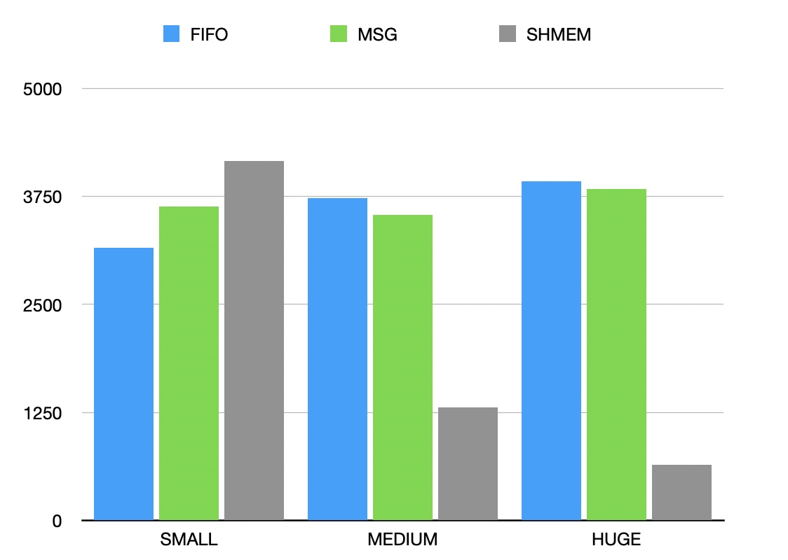

# Лабораторная работа по исследованию времени передачи файлов через разные примитивы IPC
Программа выполняет пересылку файла размером 4 GB через один из трёх примитивов IPC. При этом используется 3 разных размера промежуточного буфера.

## Примитивы IPC
 - FIFO
 - Shared memory
 - Message queue

## Размеры промежуточных буферов
- 8 KB
- 64 KB
- 1 MB

# Измерение времени
Для измерения времени передачи информации буду использовать функцию `clock()` из библиотеки `time.h`

|| FIFO | MSG_QUEUE | SHMEM |
|:----|:----------:|:----------:|:----------:|
|**SMALL**| 3153    | 3634  | 4163   |
|**MEDIUM**| 3734    | 3540   | 1311   |
|**HUGE**| 3926    | 3839   | 646   |

Время приведено в миллисекундах.

