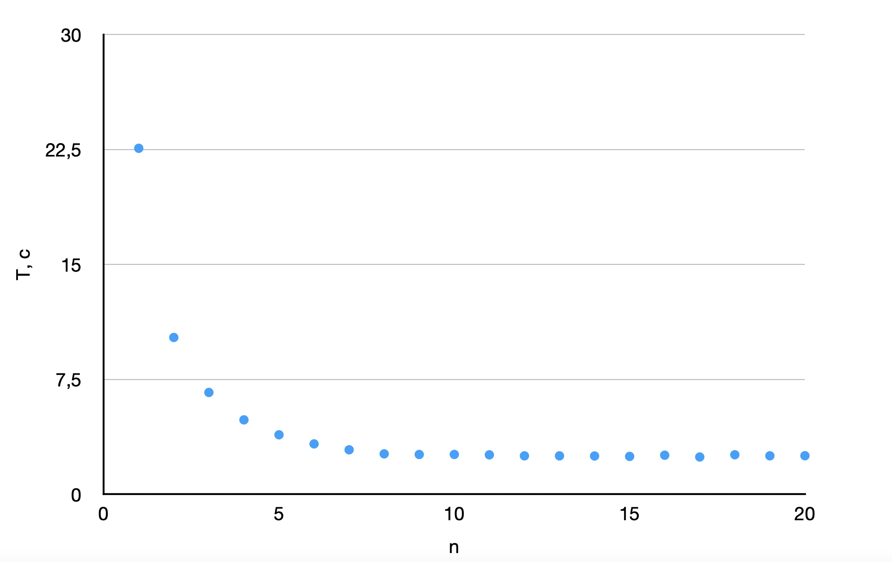

# Влияние количества потоков на производительность программы.

Программа занимается вычислением интеграла функции $$y = x^2$$
 методом Монте-Карло. Количество точек для вычисления интеграла: 1 000 000 000.

Программа запускалась на вычислительной машине с процессором Apple M2 в конфигурации с 8 ядрами (4 производительности и 4 эффективности).

## График зависимости времени работы от количества потоков:



На графике видно, что с ростом числа потоков время исполнения понижается до какого-то предела. Предел наступает, когда количество потоков достигает количества физических ядер процессора. Из графика видно, что это число от 8 - 10. Реальное число ядер в моём процессоре - 8. Следовательно эксперимент был проведен корректно.

# USAGE
### run code

```sh
mkdir build
cd build
cmake ..
make
./integral
```
